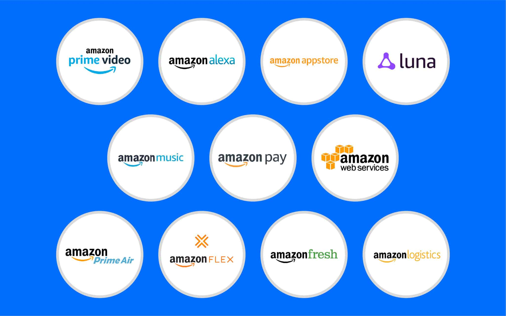
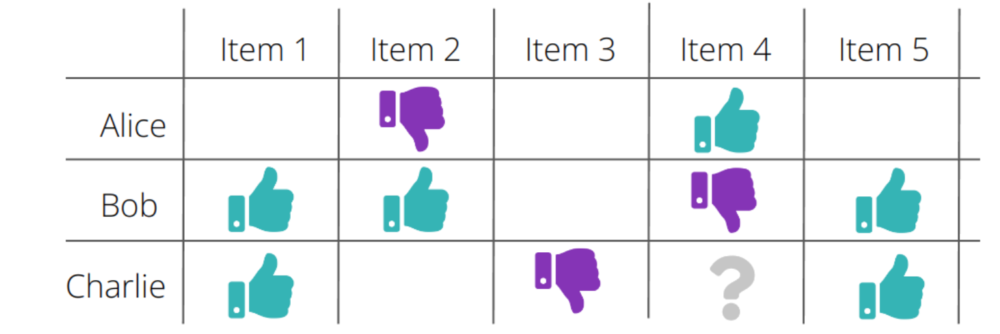
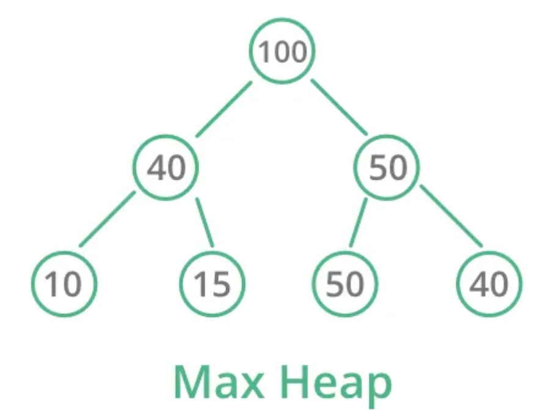

**Name:** Sanjana Patil  
**SRN:** 01FE22BCS069  
**Course Name:** Algorithmic Problem Solving  
**Course Code:** 24ECSE309  
**University:** KLE Technological University, Hubballi-31  
**Portfolio Domain:** Amazon  

## Table of Contents
- [Introduction](#introduction)
- [Objectives](#objectives)

---

# Introduction

In the digital era, Amazon has become synonymous with e-commerce, cloud computing, and intelligent logistics. What began as an online bookstore is now a global tech behemoth, consistently shaping the way consumers interact with technology, retail, and digital services. Today, Amazon operates one of the most **intelligent and optimized ecosystems** in the world.

- 📈 Amazon is valued at over **$2.166 trillion**, making it one of the top 5 most valuable companies globally.
- 👥 It serves **310+ million active users**, with over 220 million Amazon Prime subscribers worldwide.
- 🌎 Amazon ships to **100+ countries** and commands **37.6% of the U.S. e-commerce market**, well ahead of Walmart and Apple.
- 💰 With **$650.3 billion** in annual revenue and **$88.5 billion** in R&D spend, Amazon is setting benchmarks in AI, cloud infrastructure, and logistics.
- ⚙️ Heavy investments in **Trainium2 AI chips**, healthcare AI, and AWS services.

> 🔎 *Source:* [Amazon Facts & Statistics – Investing.com](https://www.investing.com/academy/statistics/amazon-facts/)

From product searches to last-mile delivery, Amazon relies on **data structures and algorithms (DSA)** to manage and optimize its massive operations. This portfolio explores how these computational tools drive business success across various domains of Amazon.

## Amazon’s Core Services and Domains

### 🛍️ E-Commerce Platform
- Amazon.com / Amazon.in  
- Amazon Prime (Fast delivery + OTT)  
- Amazon Fresh & Pantry  
- Amazon Fashion  

### 🚚 Logistics & Fulfillment
- Amazon Fulfillment Centers  
- Amazon Transportation Services  
- Last-Mile Delivery (Delivery agents, drones, etc.)  

### ☁️ Amazon Web Services (AWS)
- EC2, S3, Lambda  
- DynamoDB, RDS  
- CloudFront, Elastic Beanstalk  
- SageMaker (ML), Trainium2 AI chips  

### 📺 Digital & Entertainment
- Prime Video (200M+ users)  
- Ad-supported Prime Video (130M U.S. viewers/month)  
- Kindle, Audible  
- Twitch, IMDb  

### 💳 Fintech & Payments
- Amazon Pay (Wallet, UPI)  
- Pay Later, Credit, EMI services  

### 🧠 Smart Devices & AI
- Alexa, Echo devices  
- Fire TV, Ring  
- AI-driven healthcare (One Medical, Amazon Pharmacy)  

### 📦 B2B & Enterprise
- Amazon Business (Wholesale platform)  
- AWS tools for enterprise solutions  
- Amazon Ads (Generated $17.28B in 2025)  

---

# Objectives
-	Understand and break down Amazon’s key business domains to identify underlying algorithmic and structural components.
-	Apply algorithmic design and data structures to model and propose improvements for system performance, scalability, and efficiency.
-	Demonstrate real-world relevance of academic concepts by mapping them to challenges and innovations within Amazon’s technological ecosystem.

---
# Business Use Cases

## Product Recommendation System
To achieve highly relevant and diverse product recommendations, we can integrate two powerful approaches:

- Collaborative Filtering (CF) via Matrix Factorization, which captures user-item interaction patterns, and
- CERT (Content Enhanced Recommendation Traversal), which leverages a semantic grid of products based on product content and relationships.

### Collaborative Filtering

Collaborative filtering aims to predict user preferences by factoring the sparse user-item rating matrix into two low-rank matrices, U and V:
- R: user-item rating matrix (sparse matrix)
- U: User latent feature matrix
- V: Item latent feature matrix
- R': Predicted full matrix with all user-item scores

#### Efficient Sparse Matrix Representation with DoK
Since the original matrix R is very sparse, we can use the **Dictionary of Keys (DoK) format**:

A dictionary that stores only **non-zero ratings**:

**{(user_id, item_id): rating}**

If 1 million users rate only 0.1% of 100,000 items:
- Dense Matrix: stores 100 billion entries
- DoK: stores only 100 million actual ratings

Benefits during training:
- Only observed entries are iterated over
- Avoids allocating memory for missing ratings
- Fast lookup and dynamic updates

Benefits during inference:
For a given user i, you compute the dot product of their **user feature vector** with all **product feature vectors**. This yields predicted ratings for every product.
You rank products by predicted rating and recommend the top ones the user hasn’t rated yet.

As the dataset is huge, computed **R' is huge**, so it is computed on the fly, during inference. Hence DoK is beneficial. 

#### Storing Top-N Recommendations from CF
To store the Top-N predicted products per user, we use:
**Max-Heap** (Priority Queue) of size N per user
Efficiently tracks and maintains highest predicted ratings

Time complexity per insert: O(logN)

### CERT: Grid-based Semantic Product Traversal
CERT involves constructing a 2D grid of products, where each cell corresponds to a product ID, and semantically similar products are placed in proximity based on:
- BERT embeddings of product descriptions
- Ratings, reviews, or category information

#### **Beam Search**
**Beam Search** is a heuristic search algorithm that explores the best few paths at each step instead of all possible ones. It keeps only the top *k* (beam width) most promising candidates based on a scoring function (e.g., similarity + popularity). At each level, it expands those candidates to their neighbors, evaluates them, and again keeps only the top *k*. This continues until a goal is reached or a depth limit is hit. It’s faster than exhaustive search and works well for recommendation tasks where we want good-enough results quickly.

**Time Complexity**
- **O(w⋅b⋅d)**
- b = branching factor (number of neighbors per node, typically ≤ 4 in a 2D grid)
- w = beam width (number of paths retained at each depth)
- d = maximum depth (number of search steps or levels)

### Combining Collaborative Filtering and CERT
Once ew have both the lists, we can combine the lists, or pick alternatively in **Round Robin** fashion.

#### **Business Advantages**
* 🎯 **Better Personalization**: Combines user behavior (CF) with product meaning (CERT).
* ❄️ **Solves Cold Start**: CERT handles new users/products via embeddings.
* 🔍 **More Diverse Recs**: Avoids filter bubbles, improves discovery.
* ⚡ **Real-Time Relevance**: Adapts to both long-term and session-based context.
* 💰 **Boosts Sales**: Higher CTR, AOV, and user retention.

