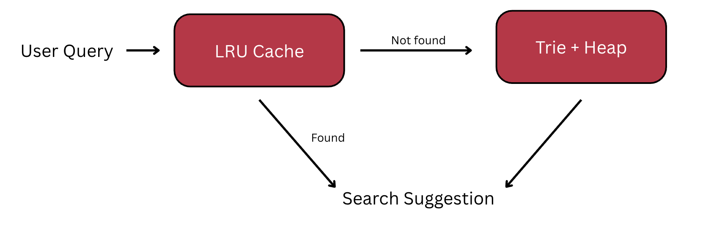
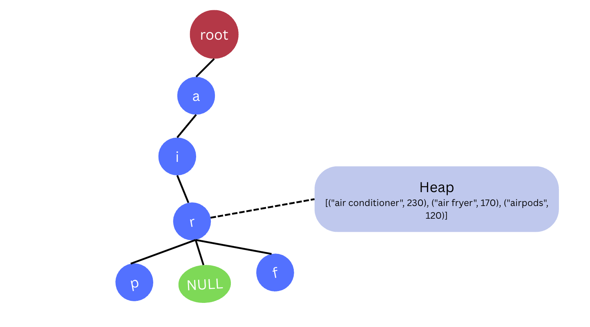
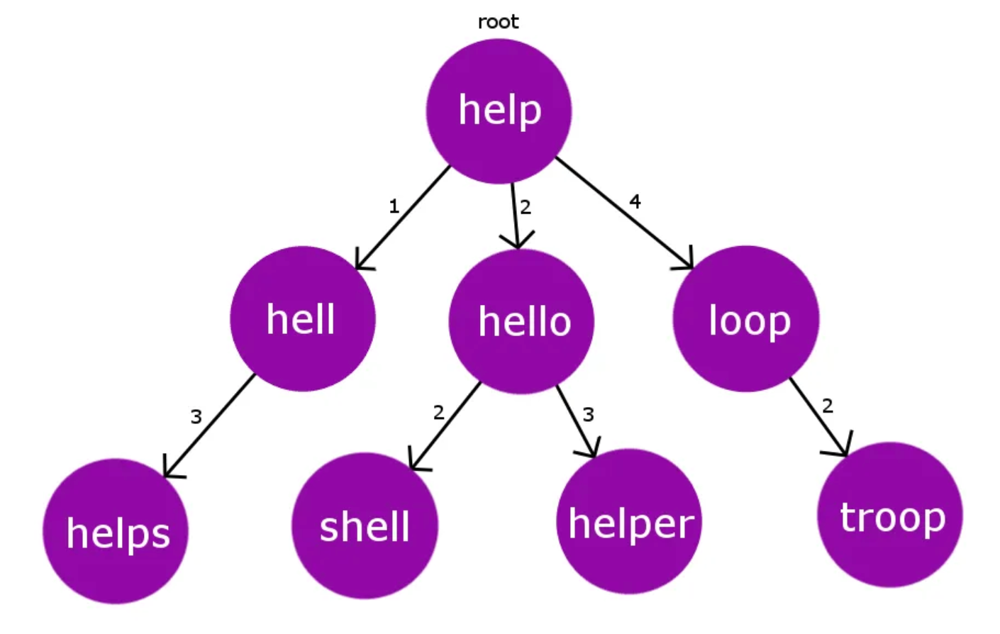
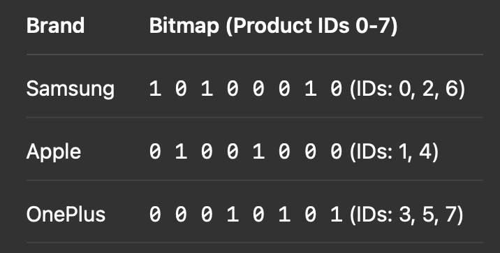
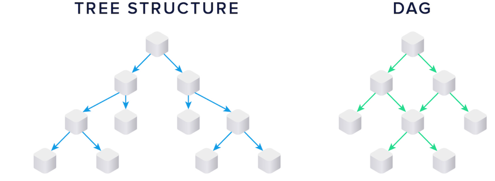
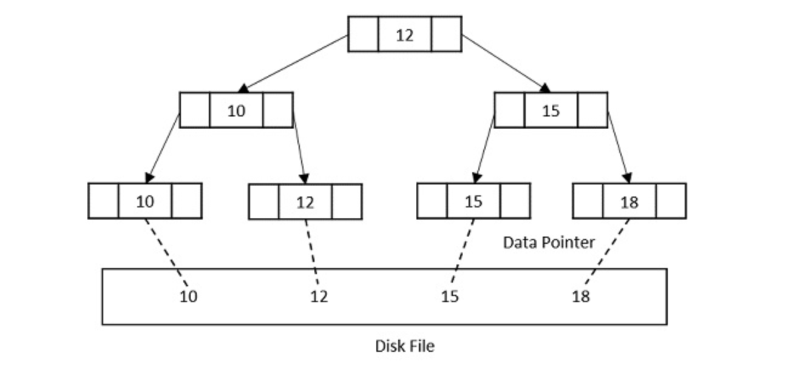
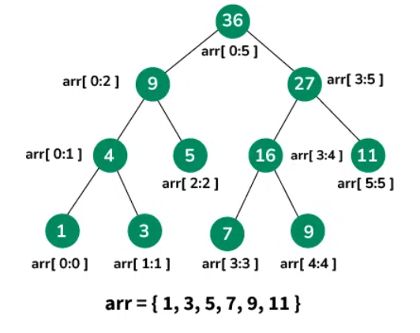
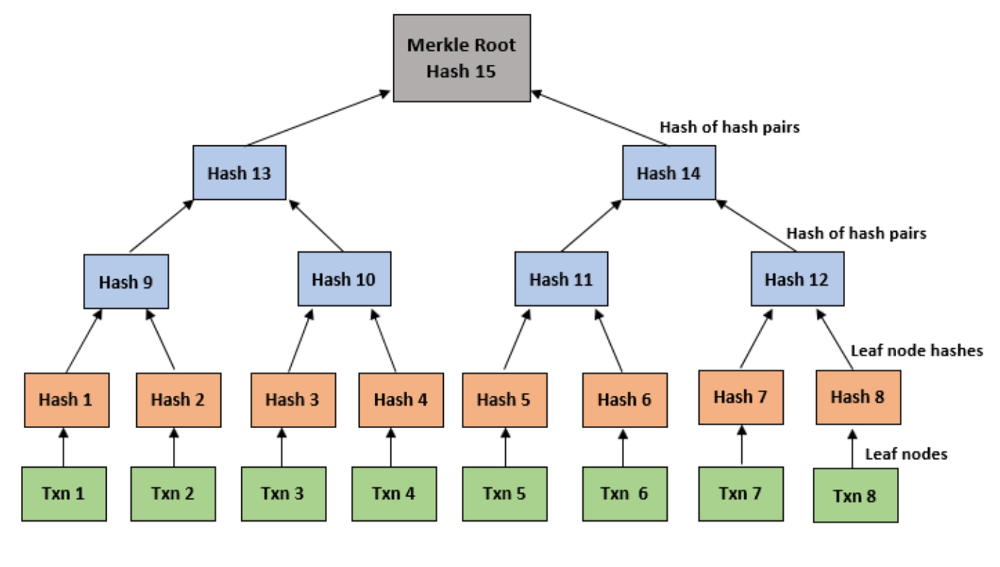
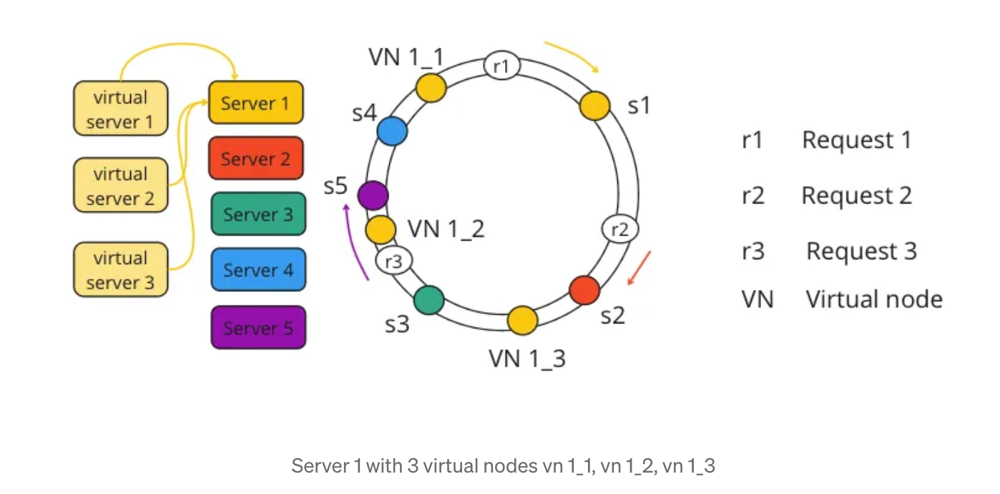
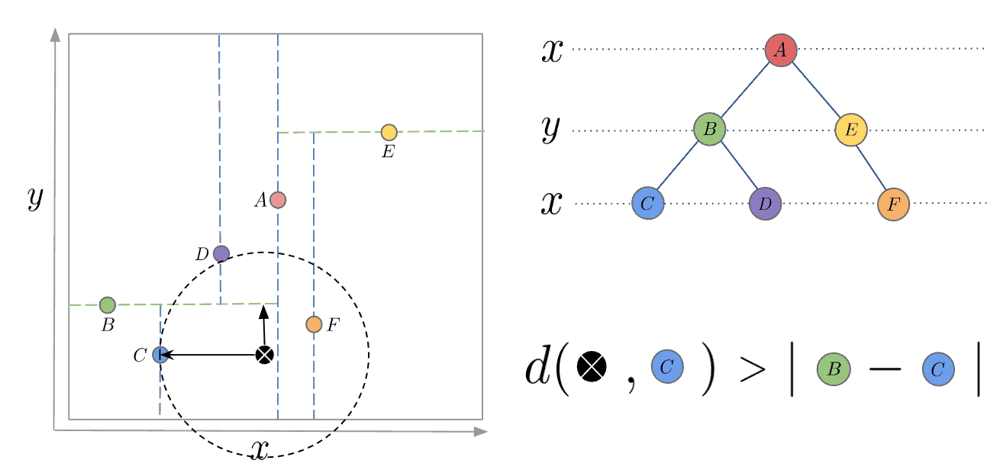

**Name:** Sanjana Patil  
**SRN:** 01FE22BCS069  
**Course Name:** Algorithmic Problem Solving  
**Course Code:** 24ECSE309  
**University:** KLE Technological University, Hubballi-31  
**Portfolio Domain:** Amazon  

## Table of Contents
- [Introduction](#introduction)
- [Objectives](#objectives)
- [Business Use Cases](#business-use-cases)

---

# Introduction

*Amazon and its services [1]*

In the digital era, Amazon has become synonymous with e-commerce, cloud computing, and intelligent logistics. What began as an online bookstore is now a global tech behemoth, consistently shaping the way consumers interact with technology, retail, and digital services. Today, Amazon operates one of the most **intelligent and optimized ecosystems** in the world.

- 📈 Amazon is valued at over **$2.166 trillion**, making it one of the top 5 most valuable companies globally.
- 👥 It serves **310+ million active users**, with over 220 million Amazon Prime subscribers worldwide.
- 🌎 Amazon ships to **100+ countries** and commands **37.6% of the U.S. e-commerce market**, well ahead of Walmart and Apple.
- 💰 With **$650.3 billion** in annual revenue and **$88.5 billion** in R&D spend, Amazon is setting benchmarks in AI, cloud infrastructure, and logistics.
- ⚙️ Heavy investments in **Trainium2 AI chips**, healthcare AI, and AWS services.

> 🔎 *Source:* [Amazon Facts & Statistics – Investing.com](https://www.investing.com/academy/statistics/amazon-facts/)

From product searches to last-mile delivery, Amazon relies on **data structures and algorithms (DSA)** to manage and optimize its massive operations. This portfolio explores how these computational tools drive business success across various domains of Amazon.

## Amazon’s Core Services and Domains

### 🛍️ E-Commerce Platform
- Amazon.com / Amazon.in  
- Amazon Prime (Fast delivery + OTT)  
- Amazon Fresh & Pantry  
- Amazon Fashion  

### 🚚 Logistics & Fulfillment
- Amazon Fulfillment Centers  
- Amazon Transportation Services  
- Last-Mile Delivery (Delivery agents, drones, etc.)  

### ☁️ Amazon Web Services (AWS)
- EC2, S3, Lambda  
- DynamoDB, RDS  
- CloudFront, Elastic Beanstalk  
- SageMaker (ML), Trainium2 AI chips  

### 📺 Digital & Entertainment
- Prime Video (200M+ users)  
- Ad-supported Prime Video (130M U.S. viewers/month)  
- Kindle, Audible  
- Twitch, IMDb  

### 💳 Fintech & Payments
- Amazon Pay (Wallet, UPI)  
- Pay Later, Credit, EMI services  

### 🧠 Smart Devices & AI
- Alexa, Echo devices  
- Fire TV, Ring  
- AI-driven healthcare (One Medical, Amazon Pharmacy)  

### 📦 B2B & Enterprise
- Amazon Business (Wholesale platform)  
- AWS tools for enterprise solutions  
- Amazon Ads (Generated $17.28B in 2025)  

---

# Objectives
-	Understand and break down Amazon’s key business domains to identify underlying algorithmic and structural components.
-	Apply algorithmic design and data structures to model and propose improvements for system performance, scalability, and efficiency.
-	Demonstrate real-world relevance of academic concepts by mapping them to challenges and innovations within Amazon’s technological ecosystem.

---
# Business Use Cases

## 1. Autocomplete and Search Suggestion 
When users start typing in the Amazon search bar, the platform shows dynamic search suggestions. These must be:
- Fast (real-time, sub-100ms)
- Relevant (based on past queries, trends, popularity)
- Personalized (based on the user’s history, region, and preferences)

  

### LRU Cache to store and quickly serve recently queried suggestions.
When users search for products, some queries are repeated very often (e.g., “iPhone”, “laptop”, “AirPods”). Without caching, the system recomputes suggestions every time — which is inefficient.

- An LRU Cache stores key-value pairs.
- When the cache is full, it evicts the least recently used entry to make room for new ones.

### Trie (Prefix Tree) and Heap

  

A Trie is a tree-like data structure where each node represents a character. Each node stores, A character, A frequency counter (how often this prefix is used).

- The most frequent Trie node can maintain a Min Heap of top-N suggestions (e.g., top 5). This allows for real-time retrieval of the best suggestions.
- Heap stores tuples like: (frequency, suggestion), so frequently searched terms float to the top.

**Time Complexity:**
- Insert a query into Trie: `O(P)`
  - `P` = length of the query (inserting character by character)
- Search suggestions for prefix: O(P + K log K)
  - O(P) to traverse down the Trie for the prefix
  - O(K log K) to retrieve top-K suggestions using a min-heap
- LRU Cache access/update: O(1) (average, using a hash map + doubly linked list)

#### **Inferences and Business Advantages**
- ⚡ Ultra-Fast Experience: Real-time suggestions under 100ms keep users engaged, reducing bounce rates.
- 🧠 Personalized Search: Region and user-history-based completions increase relevance, leading to higher conversion.
- 💰 Boosts Sales: Smart suggestions drive product discovery, upselling, and impulse purchases.
- 📈 Scalability: Trie with LRU caching efficiently handles millions of queries with minimal latency.
- 🎯 Precision: Frequent and trending queries bubble to the top, reflecting current market demand and improving user trust.
- 📉 Lower Backend Load: Caching avoids redundant computation, reducing infrastructure cost and latency.

[View Trie implementation](assets/tries.cpp)

---
## 2. Autocorrect/ typo-tolerant search

  

A BK-Tree is a tree structure designed for fast similarity searches based on edit distance (Levenshtein Distance, Hamming, etc.).

**Time Complexity**
- Insert: O(log n)
- Search: O(k log n) where k is small and depends on tolerance (edit threshold)
- Much faster than checking all words with brute force.

#### **Inferences and Business Advantages**
- 🛍️ Improved User Experience: Users get accurate results even with misspellings (e.g., “iphne” → “iPhone”), reducing friction.
- 📈 Higher Conversion Rates: Correcting typos increases the chances that users find the right product and make a purchase.
- ⚡ Faster Recovery from Input Errors: Real-time typo correction avoids "zero results" scenarios that can lead to user drop-off.
- 🌍 Multilingual & Fuzzy Search Support: Works across languages and tolerates keyboard layout errors, enhancing global accessibility.
- 💡 Reduced Bounce Rate: Users stay engaged longer by quickly finding what they meant to search for.
- 📊 Data Insights: Captures frequent typos and misspellings, helping improve search indexing and campaign targeting.

[View BK-trees implementation](assets/BK-tree.cpp)

---
## 3. Product Recommendation System
To achieve highly relevant and diverse product recommendations, we can integrate two powerful approaches:

- Collaborative Filtering (CF) via Matrix Factorization, which captures user-item interaction patterns, and
- CERT (Content Enhanced Recommendation Traversal), which leverages a semantic grid of products based on product content and relationships.

### Collaborative Filtering

  

Collaborative filtering aims to predict user preferences by factoring the sparse user-item rating matrix into two low-rank matrices, U and V:
- R: user-item rating matrix (sparse matrix)
- U: User latent feature matrix
- V: Item latent feature matrix
- R': Predicted full matrix with all user-item scores

#### Efficient Sparse Matrix Representation with DoK
Since the original matrix R is very sparse, we can use the **Dictionary of Keys (DoK) format**:

A dictionary that stores only **non-zero ratings**:

> **{(user_id, item_id): rating}**

If 1 million users rate only 0.1% of 100,000 items:
- Dense Matrix: stores 100 billion entries
- DoK: stores only 100 million actual ratings

**Space Complexity**
- O(N'), N': No. of non zero entries
  
Benefits during training:
- Only observed entries are iterated over
- Avoids allocating memory for missing ratings
- Fast lookup and dynamic updates

Benefits during inference:
-For a given user i, you compute the dot product of their **user feature vector** with all **product feature vectors**. This yields predicted ratings for every product.
-You rank products by predicted rating and recommend the top ones the user hasn’t rated yet.

As the dataset is huge, computed **R' is huge**, so it is computed on the fly, during inference. Hence DoK is beneficial. 

#### Storing Top-N Recommendations from CF
To store the Top-N predicted products per user, we use:
**Max-Heap** (Priority Queue) of size N per user
Efficiently tracks and maintains highest predicted ratings

  

Time complexity per insert: O(logN)

[View max-heap implementation](assets/max_heap.cpp)

### Grid-based Semantic Product Traversal
It involves constructing a 2D grid of products, where each cell corresponds to a product ID, and semantically similar products are placed in proximity based on:
- BERT embeddings of product descriptions
- Ratings, reviews, or category information

#### **Beam Search**
**Beam Search** is a heuristic search algorithm that explores the best few paths at each step instead of all possible ones. It keeps only the top *k* (beam width) most promising candidates based on a scoring function (e.g., similarity + popularity). At each level, it expands those candidates to their neighbors, evaluates them, and again keeps only the top *k*. This continues until a goal is reached or a depth limit is hit. It’s faster than exhaustive search and works well for recommendation tasks where we want good-enough results quickly.

**Time Complexity**
- **O(w⋅b⋅d)**
- b = branching factor (number of neighbors per node
- w = beam width (number of paths retained at each depth)
- d = maximum depth (number of search steps or levels)

### Combining Collaborative Filtering and CERT
Once we have both the lists, we can combine the lists, or pick alternatively in **Round Robin** fashion.

#### **Inferences and Business Advantages**
* 🎯 **Better Personalization**: Combines user behavior (CF) with product meaning (CERT).
* ❄️ **Solves Cold Start**: CERT handles new users/products via embeddings.
* 🔍 **More Diverse Recs**: Avoids filter bubbles, improves discovery.
* ⚡ **Real-Time Relevance**: Adapts to both long-term and session-based context.
* 💰 **Boosts Sales**: Higher CTR, AOV, and user retention.

[View Beam Search implementation](assets/beam_search.py)

---

## 4. Search with filters

Combining Bitmaps and Inverted Indexes is a powerful approach for building high-performance filtering systems

- Inverted Index: Maps attribute values to lists of product IDs.
- Bitmap / Bitset: A binary array where each bit represents whether a product has or does not have a certain attribute.

  
  

Say a user wants:
Brand = Samsung AND RAM = 6GB

<pre><code>
Samsung Bitmap:  1 0 1 0 0 0 1 0
6GB Bitmap:      1 0 1 1 0 0 0 0
-------------------------------
AND Result:      1 0 1 0 0 0 0 0 → Product IDs: 0, 2
</code></pre>

**Time Complexity:**
- Preprocessing (bitmap creation): O(n) per attribute-value (once)
- Query Time (bitwise ops):
- AND, OR, NOT on bitmaps: O(n / word_size) → practically O(1) with SIMD/word-level ops.
In practice: Extremely fast due to CPU-level vectorized operations (AVX, SSE).

**Space Complexity:** 
- Each bitmap takes n bits → n / 8 bytes
- For a attribute-value pairs: Total Space = a * n / 8 bytes

Can compress bitmaps with Roaring Bitmaps, WAH, or EWAH for low-density cases.

#### **Inferences and Business Advantages**
- ⚡ Fast Filtering: Instantaneous filter results, even with millions of products.
- 📉 Low Memory Use: Bitmaps are compact—ideal for large catalogs.
- 📈 Scalable: Easily supports complex, multi-attribute filters.
- 🤝 Great UX: Real-time filtering keeps users engaged.
- 🧠 Easy Combination: Simple AND/OR logic for compound filters.
- 🔄 Dynamic Updates: Easy to update for new attributes or products.

[View implementation](assets/swf.py)
---

## 5. Category-wise navigation

Categories and subcategories form a hierarchical tree or a DAG if some items belong to multiple categories.
- Each node is a category, and edges connect parent → child.

-	✅ Hierarchical display: Easy to create menus, breadcrumbs, and filters.
-	✅ Efficient traversal: You can easily traverse and find all subcategories.
-	✅ URL mapping: Maps cleanly to RESTful URLs like /electronics/mobiles/smartphones
-	✅ Flexible filtering: DAGs allow a product to belong to multiple categories without duplication.

DFS (Depth-First Search):
-	Used to traverse the category tree to load subcategories in-depth (e.g., preloading an entire branch).-
-	Helpful for lazy loading or recursive rendering.

**Time Complexity:**
- O(N + E) in DAGs
- In a Tree, since E = N - 1, this simplifies to O(N) (We visit each node and edge once.)

**Space Complexity:**
- O(h) for recursive DFS (call stack space).
- Worst case: height h = N (skewed tree)
- O(N) for explicit stack or visited set in DAGs (to avoid cycles/repetition)

[View DFS implementation](assets/dfs.cpp)

BFS (Breadth-First Search):
-	Useful for level-by-level traversal, e.g., rendering main categories first.
-	Helps with UI optimization when menus are loaded incrementally.

**Time Complexity:**
- O(N + E) – All nodes and edges are visited.

**Space Complexity:**
- O(w) where w = maximum number of nodes at any level (i.e., tree width).
- In worst case (flat structure): O(N)

[View BFS implementation](assets/bfs.cpp)

#### **Inferences and Business Advantages**
- 🧭 Enhanced Discoverability: Hierarchical menus guide users smoothly from broad to specific products, improving product visibility.
- ⚡ Faster Navigation: DFS and BFS enable efficient traversal and dynamic loading of subcategories, reducing page load time.
- 📈 Higher Engagement: Intuitive structure keeps users browsing longer, increasing the chance of conversion.
- 🔍 Targeted Filtering: DAGs allow flexible categorization (e.g., “Wireless Earbuds” under both “Audio” and “Mobile Accessories”), enabling smarter filters.
- 🌐 Clean URLs & SEO Boost: Structured category paths (e.g., /electronics/phones) improve indexing and click-through rates.
- 🔄 Scalable Taxonomy: Easy to add new categories/subcategories without breaking the structure or causing duplication.

---

## 6. Optimising Delivery logistics

Efficiently assigning packages to delivery vehicles is crucial to reduce fuel costs, improve delivery time, and fully utilize capacity. This cna be solved using optimization problems — Bin Packing and VRP.

Bin Packing solves: What goes in which truck?

VRP solves: What is the best delivery sequence for each truck?

In amazons ecosystem,
- Phase 1: Cluster deliveries by region → Bin Packing assigns packages to trucks.
- Phase 2: Within each truck → VRP algorithm decides the optimal delivery path.

**Time Complexity:** O(n²) to O(n³) (depending on method)

**Space Complexity:** O(n²) (distance matrix or graph)

#### **Inferences and Business Advantages**
- Reduced fuel and labor cost
- Faster deliveries and higher customer satisfaction
- Balanced load distribution across delivery fleet
- Adaptable to dynamic changes (new orders, canceled deliveries)

[View implementation](assets/vrp.py)

---

## 7. Account Managaement and Purchase History

Batabases use balanced tree structures to index purchase data, enabling fast queries by user ID or date range.
B or B+ trees can be used

**Time Complexity**
- Search: O(log n)
- Insert: O(log n)	
- Delete: O(log n)

#### **Inferences and Business Advantages**
- 🔍 Faster Lookups: Quick access to user history (e.g., past orders, returns) via indexed search.
- 🧾 Efficient Reporting: Enables fast filtering by date, product category, or order value.
- 📈 Scalability: Balanced trees maintain performance even with millions of records.
- 🔁 Smooth User Experience: Real-time account and order page loading improves satisfaction.
- 🔐 Data Integrity: Structured insertion/deletion ensures consistent and reliable storage.

[View implementation](assets/B-plus-tree.cpp)

---
## 8. Time slot management in scheduled deliveries

Amazon offers scheduled delivery where customers choose specific delivery time slots (e.g., 10 AM–12 PM). With thousands of users in each city, efficiently managing overlapping requests becomes a challenge:

- Preventing overbooking of a delivery slot.
- Quickly identifying available slots during peak demand.
- Updating and querying slot availability in real-time.

A **Segment Tree** can efficiently support:

- Range Updates: Mark multiple time slots as booked.
- Range Queries: Check if a set of slots are available.
- Point Updates: Cancel or reassign a single slot.

**Time Complexity**

- Book: O(log n)
- Cancel: O(log n)
- sAvailable: O(log n)

#### **Inferences and Business Advantages**
- ⏱ Real-Time Slot Handling: Fast updates and checks help serve thousands of users instantly.
- 🚫 Avoids Overbooking: Ensures slot capacity limits are respected even under heavy demand.
- 📊 Efficient Resource Use: Maximizes delivery personnel and vehicle utilization by balancing loads.
- 🔁 Flexible Rescheduling: Allows quick cancellation and rebooking without affecting system performance.
- 💡 Scalable During Festivals or Sales: Handles rapid surges in slot bookings without slowing down.

[View implementation](assets/seg-trees.cpp)

---

## 9. GDPR & Privacy Compliance

To ensure compliance with privacy regulations like GDPR, large-scale platforms like Amazon must track, log, and audit data access, user consent, and modifications. These logs must be:
- Tamper-proof
- Efficiently verifiable
- Cryptographically secure
- Scalable to billions of records

This is where **Merkle Trees** and append-only logs can be used.

**Time Complexity**
- Build Tree: O(n)
- Verify Inclusion: O(log n)
- Add Entry (Append-only): O(log n) (rebuilding partial tree paths)
- Verify Root Integrity: O(1) (comparing root hash)

#### **Inferences and Business Advantages**
- mmutable audit trails
- Cryptographic verification of data integrity
- Trustworthy user data tracking and access history

[View implementation](assets/m-tree.cpp)

--- 
## 10. Optimizing Content Delivery with Consistent Hashing + Virtual Nodes

Naive/modulo-based hashing breaks under node addition/removal:
- Causes massive reallocation of keys.
- Doesn’t support uneven server capacities.
- Leads to hotspots or imbalanced load.

### ⏱️ Time and Space Complexity: Consistent Hashing + Virtual Nodes

| Operation                        | Time Complexity              | Space Complexity         |
|----------------------------------|-------------------------------|---------------------------|
| **Hashing a Key**               | `O(1)`                        | `O(1)`                    |
| **Placing vnodes on ring**      | `O(N log N)` (initial sort)  | `O(V)` → V = total vnodes |
| **Key Lookup (binary search)**  | `O(log V)`                   | `O(V)`                    |
| **Adding a node**               | `O(log V)` per vnode added   | `O(k)` → k = vnodes added |
| **Removing a node**             | `O(log V)` per vnode removed | `O(k)`                    |
| **Reassignment of keys**        | `~O(K/V)`                    | —                         |

**Legend**:
- `N`: Number of servers  
- `V`: Number of virtual nodes  
- `K`: Total number of keys  
- `k`: Number of vnodes added/removed

**Notes**
- Vnodes ensure **balanced key distribution** even with uneven server capacity.
- **Key lookups** are fast due to binary search on sorted vnode positions.
- **Adding/removing nodes** only affects a small portion of the ring (~`1/N` of keys).

#### **Inferences and Business Advantages**
- Balanced load prevents server overload and cuts costs
- Seamless scaling with minimal downtime
- Efficient hardware use via weighted distribution
- Easy, non-disruptive infrastructure changes
- Reliable failover and fault testing
- Faster global content delivery
- Reduced operational and cloud expenses

[View implementation](assets/vnodes.py)

---

## 11. Geofencing-based Offers

Send app notifications when a user walks into a mall that sells a wishlisted product.

#### KD-Trees for 2D spatial search
Given a user’s (latitude, longitude) location, you can perform nearest-neighbor or range queries to find the geofences the user is within.

**Time n Space Complexity**
- KD-Tree Construction: O(N log N)	O(N)
- KD-Tree Query (range/NN): O(log N + K)	—

N = Number of geofences, K = Number of matched zones, W = Wishlist size

#### Hash Sets to lookup geofence zones a user enters in constant time

Store user wishlists or interest tags in a hash set.
- Store geofenced areas and their mapped product categories (e.g., mall A → electronics).
- When user enters a geofenced region, check if any intersection exists between:
- userWishList ∩ geoZoneProducts

**Time n Space Complexity**
- HashSet lookup: O(1) per item		O(W) for user wishlist

#### **Inferences and Business Advantages**
- 🎯 Highly Targeted Marketing: Sends relevant offers only when users enter specific locations, increasing conversion rates.
- 📱 Improved User Engagement: Timely notifications boost app interaction and customer loyalty.
- 🚀 Efficient Spatial Queries: Fast location lookups ensure real-time responsiveness without lag.
- 🔄 Personalized Experience: Combines user preferences (wishlist) with physical context for smarter promotions.
- 💸 Cost-Effective Campaigns: Reduces wasted advertising by focusing on users who are physically near relevant products.
- 📈 Increased Sales: Drives foot traffic and impulse purchases at geofenced stores.

[View implementation](assets/kd-trees.cpp)

---

# Learnings

In this portfolio, I’ve explored how the concepts I learned in Data Structures and Algorithms (DSA) and Advanced Problem Solving (APS) can be directly applied to real-world business problems. Each section focuses on a specific use case—from optimizing product search using bitmap filtering, to dynamic pricing with segment trees, to efficient content delivery through consistent hashing and virtual nodes. I’ve tried to connect theoretical knowledge to practical applications by identifying which algorithms solve which business challenges most effectively. This helped me understand not just how these algorithms work, but when and why to use them. By linking what I’ve studied to actual industry scenarios across e-commerce, logistics, digital systems, and cloud computing, I’ve realized how important it is to pick the right algorithm for the right context. This portfolio reflects my effort to think like a system designer, not just a coder—and has made me more confident in using DSA concepts to build efficient, scalable solutions.

---

# References

[1] [Amazon Facts & Statistics – Investing.com](https://www.investing.com/academy/statistics/amazon-facts/)
