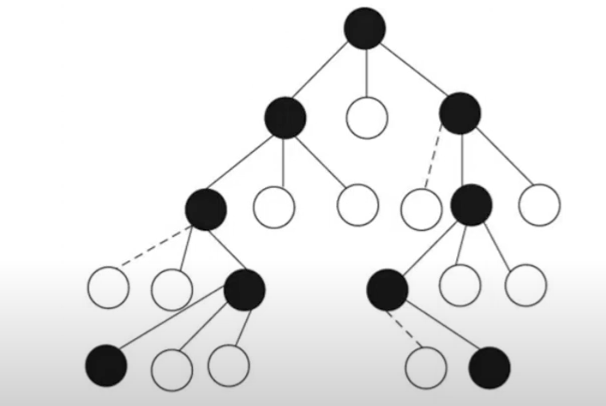

**Name:** Sanjana Patil  
**SRN:** 01FE22BCS069  
**Course Name:** Algorithmic Problem Solving  
**Course Code:** 24ECSE309  
**University:** KLE Technological University, Hubballi-31  
**Portfolio Domain:** Amazon  

## Table of Contents
- [Introduction](#introduction)
- [Objectives](#objectives)

---

# Introduction

In the digital era, Amazon has become synonymous with e-commerce, cloud computing, and intelligent logistics. What began as an online bookstore is now a global tech behemoth, consistently shaping the way consumers interact with technology, retail, and digital services. Today, Amazon operates one of the most **intelligent and optimized ecosystems** in the world.

- 📈 Amazon is valued at over **$2.166 trillion**, making it one of the top 5 most valuable companies globally.
- 👥 It serves **310+ million active users**, with over 220 million Amazon Prime subscribers worldwide.
- 🌎 Amazon ships to **100+ countries** and commands **37.6% of the U.S. e-commerce market**, well ahead of Walmart and Apple.
- 💰 With **$650.3 billion** in annual revenue and **$88.5 billion** in R&D spend, Amazon is setting benchmarks in AI, cloud infrastructure, and logistics.
- ⚙️ Heavy investments in **Trainium2 AI chips**, healthcare AI, and AWS services.

> 🔎 *Source:* [Amazon Facts & Statistics – Investing.com](https://www.investing.com/academy/statistics/amazon-facts/)

From product searches to last-mile delivery, Amazon relies on **data structures and algorithms (DSA)** to manage and optimize its massive operations. This portfolio explores how these computational tools drive business success across various domains of Amazon.

## Amazon’s Core Services and Domains

### 🛍️ E-Commerce Platform
- Amazon.com / Amazon.in  
- Amazon Prime (Fast delivery + OTT)  
- Amazon Fresh & Pantry  
- Amazon Fashion  

### 🚚 Logistics & Fulfillment
- Amazon Fulfillment Centers  
- Amazon Transportation Services  
- Last-Mile Delivery (Delivery agents, drones, etc.)  

### ☁️ Amazon Web Services (AWS)
- EC2, S3, Lambda  
- DynamoDB, RDS  
- CloudFront, Elastic Beanstalk  
- SageMaker (ML), Trainium2 AI chips  

### 📺 Digital & Entertainment
- Prime Video (200M+ users)  
- Ad-supported Prime Video (130M U.S. viewers/month)  
- Kindle, Audible  
- Twitch, IMDb  

### 💳 Fintech & Payments
- Amazon Pay (Wallet, UPI)  
- Pay Later, Credit, EMI services  

### 🧠 Smart Devices & AI
- Alexa, Echo devices  
- Fire TV, Ring  
- AI-driven healthcare (One Medical, Amazon Pharmacy)  

### 📦 B2B & Enterprise
- Amazon Business (Wholesale platform)  
- AWS tools for enterprise solutions  
- Amazon Ads (Generated $17.28B in 2025)  

---

# Objectives
-	Understand and break down Amazon’s key business domains to identify underlying algorithmic and structural components.
-	Apply algorithmic design and data structures to model and propose improvements for system performance, scalability, and efficiency.
-	Demonstrate real-world relevance of academic concepts by mapping them to challenges and innovations within Amazon’s technological ecosystem.

---
# Business Use Cases

## 1. Autocomplete and Search Suggestion 
When users start typing in the Amazon search bar, the platform shows dynamic search suggestions. These must be:
- Fast (real-time, sub-100ms)
- Relevant (based on past queries, trends, popularity)
- Personalized (based on the user’s history, region, and preferences)

  

### LRU Cache to store and quickly serve recently queried suggestions.
When users search for products, some queries are repeated very often (e.g., “iPhone”, “laptop”, “AirPods”). Without caching, the system recomputes suggestions every time — which is inefficient.

- An LRU Cache stores key-value pairs.
- When the cache is full, it evicts the least recently used entry to make room for new ones.

### Trie (Prefix Tree) and Heap

  

A Trie is a tree-like data structure where each node represents a character. Each node stores, A character, A frequency counter (how often this prefix is used).

- The most frequent Trie node can maintain a Min Heap of top-N suggestions (e.g., top 5). This allows for real-time retrieval of the best suggestions.
- Heap stores tuples like: (frequency, suggestion), so frequently searched terms float to the top.

**Time Complexity:**
- O(P + K log K)
- P: Length of the prefix typed
- K: Number of suggestions returned
- Traverse the prefix in Trie (O(P)), then extract top K suggestions (O(K log K) if heapified)

---
## 2. Autocorrect/ typo-tolerant search

  

A BK-Tree is a tree structure designed for fast similarity searches based on edit distance (Levenshtein Distance, Hamming, etc.).

**Time Complexity**
- Insert: O(log n)
- Search: O(k log n) where k is small and depends on tolerance (edit threshold)
- Much faster than checking all words with brute force.

---
## 3. Product Recommendation System
To achieve highly relevant and diverse product recommendations, we can integrate two powerful approaches:

- Collaborative Filtering (CF) via Matrix Factorization, which captures user-item interaction patterns, and
- CERT (Content Enhanced Recommendation Traversal), which leverages a semantic grid of products based on product content and relationships.

### Collaborative Filtering

  

Collaborative filtering aims to predict user preferences by factoring the sparse user-item rating matrix into two low-rank matrices, U and V:
- R: user-item rating matrix (sparse matrix)
- U: User latent feature matrix
- V: Item latent feature matrix
- R': Predicted full matrix with all user-item scores

#### Efficient Sparse Matrix Representation with DoK
Since the original matrix R is very sparse, we can use the **Dictionary of Keys (DoK) format**:

A dictionary that stores only **non-zero ratings**:

> **{(user_id, item_id): rating}**

If 1 million users rate only 0.1% of 100,000 items:
- Dense Matrix: stores 100 billion entries
- DoK: stores only 100 million actual ratings

**Space Complexity**
- O(N'), N': No. of non zero entries
  
Benefits during training:
- Only observed entries are iterated over
- Avoids allocating memory for missing ratings
- Fast lookup and dynamic updates

Benefits during inference:
-For a given user i, you compute the dot product of their **user feature vector** with all **product feature vectors**. This yields predicted ratings for every product.
-You rank products by predicted rating and recommend the top ones the user hasn’t rated yet.

As the dataset is huge, computed **R' is huge**, so it is computed on the fly, during inference. Hence DoK is beneficial. 

#### Storing Top-N Recommendations from CF
To store the Top-N predicted products per user, we use:
**Max-Heap** (Priority Queue) of size N per user
Efficiently tracks and maintains highest predicted ratings

  

Time complexity per insert: O(logN)

### Grid-based Semantic Product Traversal
It involves constructing a 2D grid of products, where each cell corresponds to a product ID, and semantically similar products are placed in proximity based on:
- BERT embeddings of product descriptions
- Ratings, reviews, or category information

#### **Beam Search**
**Beam Search** is a heuristic search algorithm that explores the best few paths at each step instead of all possible ones. It keeps only the top *k* (beam width) most promising candidates based on a scoring function (e.g., similarity + popularity). At each level, it expands those candidates to their neighbors, evaluates them, and again keeps only the top *k*. This continues until a goal is reached or a depth limit is hit. It’s faster than exhaustive search and works well for recommendation tasks where we want good-enough results quickly.

**Time Complexity**
- **O(w⋅b⋅d)**
- b = branching factor (number of neighbors per node
- w = beam width (number of paths retained at each depth)
- d = maximum depth (number of search steps or levels)

### Combining Collaborative Filtering and CERT
Once we have both the lists, we can combine the lists, or pick alternatively in **Round Robin** fashion.

#### **Business Advantages**
* 🎯 **Better Personalization**: Combines user behavior (CF) with product meaning (CERT).
* ❄️ **Solves Cold Start**: CERT handles new users/products via embeddings.
* 🔍 **More Diverse Recs**: Avoids filter bubbles, improves discovery.
* ⚡ **Real-Time Relevance**: Adapts to both long-term and session-based context.
* 💰 **Boosts Sales**: Higher CTR, AOV, and user retention.
  
---

## 4. Search with filters

Combining Bitmaps and Inverted Indexes is a powerful approach for building high-performance filtering systems

- Inverted Index: Maps attribute values to lists of product IDs.
- Bitmap / Bitset: A binary array where each bit represents whether a product has or does not have a certain attribute.

  
  

Say a user wants:
Brand = Samsung AND RAM = 6GB

<pre><code>
Samsung Bitmap:  1 0 1 0 0 0 1 0
6GB Bitmap:      1 0 1 1 0 0 0 0
-------------------------------
AND Result:      1 0 1 0 0 0 0 0 → Product IDs: 0, 2
</code></pre>

